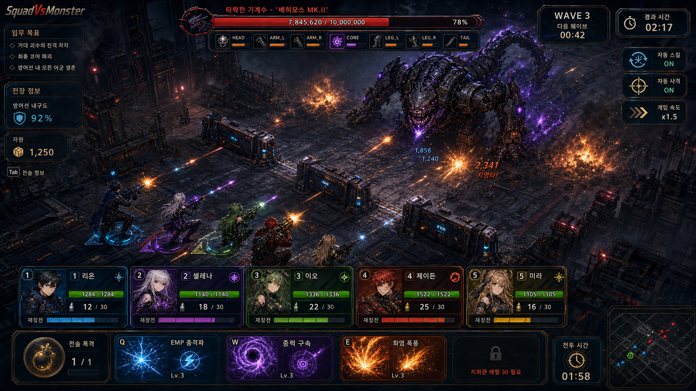

# SquadVsMonster

- 문서 유형: 게임 디자인 문서(GDD)
- 문서 버전: 2.0
- 최신화: 2026-09-11 (KST)
- 프로젝트/소스 기준 버전: v1.7.0 (근거: `ProjectSettings/ProjectSettings.asset` `bundleVersion: 1.7.0`, `docs/SquadVsMonster_BuildValidation_2026-09-08.md` "Source version: 1.7.0. Existing portable: 1.6.0.")
- 근거 표기 범례: **[사실]** = 코드/애셋 파일 직접 확인, **[제안]** = 미검증 가설, **미검증** = 확인 시도했으나 소스에서 값/구현을 찾지 못함

## 0. 버전 확정 근거와 실행파일 불일치 주의

- **[사실]** `ProjectSettings/ProjectSettings.asset` 144행 `bundleVersion: 1.7.0` — Unity 프로젝트의 권위 버전 소스.
- **[사실]** `docs/SquadVsMonster_BuildValidation_2026-09-08.md`: "Source version: 1.7.0. Existing portable: 1.6.0." — 소스 코드는 1.7.0으로 올라갔지만 실제로 배포된 portable exe(`SquadVsMonster_v1.6.0_portable.exe`, 루트/`release/` 동일)는 아직 1.6.0 빌드다.
- **[사실]** `docs/SquadVsMonster_기획서.md`는 "기획서 v1.6.0"으로 표기되어 있고 최신화일은 2026-07-16이다. 즉 기획서 문서와 실제 소스 버전 사이에도 갭이 있다.
- 결론: 본 GDD는 **소스 기준 v1.7.0**을 프로젝트 버전으로 표기한다. 플레이 가능한 실행 파일(portable exe)은 아직 v1.6.0 빌드이므로, 신규 재현·QA 시 이 갭을 인지해야 한다 **[사실]**.

## 1. 플레이 예시 미리보기

두 이미지 모두 `docs/` 폴더에 실재하는 파일이며 **[사실]**, 기존 `SquadVsMonster_기획서.md`가 `SquadVsMonster_gameplay_preview.png`를 문서용 공유 이미지로 이미 사용 중이므로 해당 상대경로 링크를 그대로 보존했다.

## 2. 문제 정의

스쿼드 자동전투와 보스 공략을 좋아하는 플레이어는 전투가 자동으로 진행될수록 "내 조합이 왜 이겼고 왜 졌는지"를 놓치기 쉽다 **[제안, 기존 기획서 문제정의 계승]**. SquadVsMonster는 짧은 보스전 세션에서 약점 조준, 재장전 타이밍, 생존 커버 상태를 실시간으로 읽게 하고, 전투 종료 직후 "다음에 무엇을 바꿔야 하는지"를 한 줄로 짚어주는 Unity 2D 전투 프로토타입이다.

- **[사실]** `SquadMemberConfigSO` 5종(Alpha/Bravo/Charlie/Delta/Echo), `MinionConfigSO` 3종(Runner/Berserker/Spitter), `BossConfigSO` 1종(파츠 7개)이 애셋으로 존재해 스쿼드-미니언-보스 3축 전투 구조가 실재함(`Assets/Configs/*.asset`).
- **[사실]** `CombatAdvisorLogic.cs`가 전투 전 조합 프리뷰(`GetSquadCompositionPreview`)와 전투 후 결과 요약(`GetWaveResultSummary`, cue line 포함)을 계산하는 로직으로 실존함.

## 3. 한 줄 피치

보스 부위 약점과 스쿼드 역할을 읽고, 자동전투 결과를 다음 판단(재조준·역할 배분)으로 바로 연결하는 세션형 보스 공략 슈터.

## 4. 디자인 필러 (Design Pillars)

1. **읽히는 판단 근거** — 승패가 "운"이 아니라 "약점 조준/재장전 타이밍/화력 배분" 중 어느 병목이었는지 즉시 드러나야 한다. 근거: `CombatAdvisorLogic.GetWaveResultSummary`가 생존 붕괴/화력 부족/재장전 겹침/타이밍 실패 4가지 원인 분기를 코드로 구현 **[사실]**.
2. **보스 부위 파괴 전략** — 보스는 단일 HP바가 아니라 부위별(HEAD/CHEST/ARM_L/ARM_R/LEG_L/LEG_R/CORE) HP와 데미지 배율을 갖고, CORE는 시작 시 비활성 상태다. 근거: `BossConfig.asset`의 7개 `parts` 항목, CORE `activeOnStart: 0`, `damageMult: 3` **[사실]**.
3. **즉시 개입 가능한 반자동 전투** — 완전 방치형이 아니라 `AimController`로 조준을 개입할 수 있고, `CombatAdvisorUI`가 실시간 조언을 띄운다. 근거: `Assets/Scripts/Entities/Squad/AimController.cs`, `Assets/Scripts/UI/CombatAdvisorUI.cs`, `AimControllerTests.cs` 존재 **[사실]**.

## 5. 구성요소

| 요소 | 역할 | 선택지 | 입력 → 판단 → 피드백 | 상태 |
|---|---|---|---|---|
| 스쿼드 5인(Alpha/Bravo/Charlie/Delta/Echo) | 화력/생존 담당, 고정 슬롯 배치 | 현재는 선택지 없음 — 5명 전원이 고정 슬롯에 자동 스폰됨 **[사실, `SquadRuntimeSpawner.SpawnSquad`가 `Mathf.Min(5, squadConfigs.Length)`로 5명을 `GameConfig.SQUAD_SLOT_X/Y` 고정 좌표에 배치]** | 입력: 없음(자동 배치) → 판단: 무기 DPS/사거리/스페셜로 조합 성향 계산 → 피드백: `CombatAdvisorUI`의 Firepower/Defense/Position 라벨 | 정상 사격 / 재장전 / 다운(HP 0) |
| 보스(단일, 7파츠) | 메인 위협, 벽 파괴 목표 | 플레이어 선택지 없음(고정 스폰) | 입력: 스쿼드 조준·화력 집중 → 판단: 파츠별 HP 감소, CORE 노출 조건(CHEST 파괴 추정, `activeOnStart:0`) → 피드백: `BossHudSceneTests` 기반 BossHUD로 부위 상태 표시 | 이동 중 / 공격 중 / 분노(Enrage) / 파츠 파괴됨 / 격파됨 |
| 미니언(Runner/Berserker/Spitter) | 방벽/바리케이드 압박, 시간 압박 자원 | 없음(웨이브 자동 생성) | 입력: 없음(자동) → 판단: `WaveSystem.GetPhaseParams`가 경과시간·분노여부로 종류 가중치·간격 결정 → 피드백: 방벽/바리케이드 HP 감소, 격파 시 `DamageNumber` | 이동 중 / 공격 중 / 처치됨 |
| 방벽/바리케이드/도로블록(지형) | 보스·미니언 진입 저지, 생존 자원 | 없음(자동 손상) | 입력: 없음 → 판단: `TerrainManager`가 HP 3단계(healthy/damaged/critical) 스프라이트 전환 → 피드백: 스프라이트 변화, `WallHpBarUI` | healthy / damaged / critical / 파괴됨 |
| 폭격(BombingSystem) | 유일한 플레이어 능동 스킬 | 발동 위치 선택(1개, 쿨다운 20초) | 입력: 플레이어가 좌표 지정 → 판단: 반경 1.5 내 보스 파츠·미니언에 300 데미지 → 피드백: `BombButtonUI` 쿨다운 링 | 준비됨 / 쿨다운 중 |
| CombatAdvisor(조언 시스템) | 상황 해설자 | 없음(자동 텍스트) | 입력: 전투 상태 변화 → 판단: 보스 파츠 활성 상태, 재장전/다운 수 → 피드백: 텍스트 팁(`GetBossPartTip`, `GetSquadTip`) | 기본 안내 / 위험(다운 발생) / 경고(재장전 다수) |
| 업그레이드 카드(로그라이크 확장) | 스테이지 반복 성장 | 3장 중 1장(설계상) | **미검증 — 실제 게임 루프에서 카드가 표시되거나 적용되는 코드 경로가 없음** | 데이터만 존재(미가동) |

## 6. 콘텐츠 제공 방식 (해금·순서·보상·변형)

### 6.1 구현됨 — 단일 세션 내 콘텐츠

- **[사실]** 스쿼드 5종 전원 고정 배치, 해금 시스템 없음(`SquadRuntimeSpawner.cs`에 잠금/해제 로직 없음, 시작부터 5명 전원 스폰). 즉 "해금"은 존재하지 않고, 매 판 5명 전원이 동일하게 등장한다.
- **[사실]** 미니언 3종(Runner/Berserker/Spitter)은 `WaveSystem.GetPhaseParams`에 따라 경과 시간별 등장 가중치가 변한다:
  - 0~5초: Runner 100%
  - 5~12초: Runner 100%
  - 12~22초: Runner 90 / Berserker 10
  - 22~32초: Runner 75 / Berserker 15 / Spitter 10
  - 32~45초: Runner 60 / Berserker 25 / Spitter 15
  - 45~60초: Runner 50 / Berserker 30 / Spitter 20
  - 60초 이후: Runner 40 / Berserker 35 / Spitter 25
  - 분노(Enrage) 상태: Runner 50 / Berserker 30 / Spitter 20, 간격 2.0초 고정, 1회 5~9마리 스폰
  - 이는 "순서/변형"에 해당하는 실제 콘텐츠 페이싱이다 **[사실, `WaveSystem.cs`]**.
- **[사실]** 보스 파츠 7종은 시작 시 CORE만 비활성(`activeOnStart: 0`)이고 나머지 6개는 활성 — 즉 CHEST(1200hp)·ARM_L/R(400hp)·LEG_L/R(350hp)·HEAD(600hp)를 먼저 노출시키고 CORE(800hp, damageMult 3)는 특정 조건(코드상 CORE 노출 트리거는 `BossPartController`/`BossController` 쪽 로직 확인 필요 — **미검증**, 어떤 조건으로 CORE가 활성화되는지 본 세션에서 `BossController.cs`/`BossPartController.cs` 내부 활성화 조건까지는 직접 추적하지 못함)로 열리는 구조다.
- **[사실]** 보상: 처치/승리에 따른 재화, 강화 아이템 등 메타 보상 시스템은 **미검증**(관련 Config/PlayerPrefs 저장소를 찾지 못함). `GameManager`는 Win/Lose 상태와 `WaveResultSummary`만 계산하고 별도 보상 지급 로직은 없음 **[사실, `GameManager.cs` 전체 열람 결과]**.

### 6.2 계획됨 — 데이터만 존재, 런타임 미연결 (로그라이크 확장)

- **[사실]** `docs/specs/2026-04-22-roguelike-upgrade-design.md`에 보스 처치 후 업그레이드 카드 3장 선택 → 재배치 → 무한 스테이지 반복 루프가 설계되어 있음.
- **[사실]** 설계 문서가 요구하는 핵심 클래스 `RunState.cs`, `StageManager.cs`, `UpgradeUI.cs`, `UpgradeCardUI.cs`, `DeploymentUI.cs`, `DeploymentSlotUI.cs`, `DeploymentMemberCard.cs`는 `Assets/Scripts/**/*.cs` 전체 탐색 결과 **존재하지 않는다**(검색 결과 0건). 즉 스테이지 반복 로직 자체는 코드로 구현되지 않았다.
- **[사실]** 다만 데이터 계층은 부분적으로 만들어져 있다: `UpgradeCardSO.cs`(실제 클래스는 설계 문서보다 단순화된 버전 — `UpgradeTargetType`은 `SpecificMember/WeaponType/Global` 3종뿐이고 설계 문서의 `ElementType` 타깃은 없음)와 카드 애셋 16개:
  - 스쿼드별(Alpha/Bravo/Charlie/Delta/Echo) × (Damage, Secondary) = 10개
  - Global 카드 3종 × (한국어/영어 페어) = 6개: 폭격 보급(Airstrike Supply, BombCharge +1, maxStacks 3), 바리케이드 증설(Barricade Extension, Barricade +1, maxStacks 3), 분대 강화(Squad Reinforcement)
  - 합계 16개 `.asset` 파일 확인 **[사실, `Assets/Configs/UpgradeCard_*.asset`]**. 한국어/영어 페어는 동일 효과의 로컬라이즈 변형으로 보이며 실제 카드 풀 로직(추출 개수 등)은 미연결이라 게임 내 노출 개수는 **미검증**.
- **[제안]** 이 로그라이크 루프가 완성되면 "변형"(무기 타입 8종, 원소 5종, 힐러/버�퍼 지원 무기)까지 콘텐츠가 크게 확장될 설계지만, 현재는 설계 문서 수준이다.

### 6.3 제안 — 아직 설계/코드 어디에도 없음

- 스쿼드 편성(누구를 낼지 선택) UI. 현재는 5명 고정 스폰이라 "편성"이라는 행위 자체가 플레이어에게 없다 **[제안]**.
- 메타 재화/강화/영구 해금 시스템 **[제안, 근거: Config 폴더에 재화/강화 관련 SO 없음]**.
- 튜토리얼/온보딩 화면 **[제안, 근거: 기획서 "알려진 리스크"에도 '튜토리얼 첫 웨이브'가 우선순위 4번 미착수 항목으로 남아있음]**.

## 7. Core Loop (핵심 루프) / 재미 체인 (Fun Chain)

**입력 → 판단 → 피드백 → 보상**의 흐름을 실제 코드 경로로 검증하면 다음과 같다.

1. **입력**: 플레이어가 조준 마커를 드래그하거나(`AimController`), 폭격 버튼을 눌러 좌표를 지정한다(`BombingSystem.Activate`) **[사실]**.
2. **판단**: `CombatAdvisorLogic.GetBossPartTip`이 현재 활성 파츠(CORE > CHEST > LEG > ARM > HEAD 우선순위)를 계산해 "지금 뭘 쏴야 하는지"를 알려주고, `GetSquadTip`이 다운/재장전 인원 수로 위험도를 알려준다 **[사실]**.
3. **피드백**: `CombatAdvisorUI`가 텍스트 조언을 표시하고, `DamageNumberSystem`/`HitFlash`/`CameraShaker`/`VFXSystem`이 타격 시 시각 피드백을 준다(`Assets/Scripts/UI/DamageNumber.cs`, `Core/HitFlash.cs`, `Core/CameraShaker.cs`, `Systems/VFXSystem.cs` 실재 **[사실]**). `RuntimeAudioDirector`가 결정론적 피치(7단계, 0.97~1.03배)로 SFX를 재생해 반복 타격이 단조롭지 않게 한다 **[사실]**.
4. **보상(=다음 판단 재료)**: 전투 종료 시 `GetWaveResultSummary`가 승패 원인을 한 줄 cue line으로 압축한다(예: "Cue: damage bottleneck from stacked reloads; stagger volleys."). 이 cue가 다음 판의 조준 우선순위·역할 배분 결정을 만든다 **[사실]**. 다만 이 "보상"은 재화나 성장이 아니라 **정보 보상**(다음에 뭘 할지 아는 것)이며, 실질적 파워업 보상 루프는 6.2에서 확인한 대로 미가동 상태다.

이 체인은 "게임이 이겼다/졌다"만 말하는 대신 병목을 지목한다는 점에서, 승패 자체보다 판단력 향상이라는 재미를 설계 목표로 삼고 있다 **[제안]**.

## 8. Session (세션): 30초 / 5분 / 30분 / 장기

| 시간대 | 플레이어가 보는 것 | 근거 |
|---|---|---|
| 30초 | 전투 시작 직후 5명 고정 스폰 → `CombatAdvisorUI`의 조합 프리뷰(Firepower/Defense/Position 라벨)가 뜬다 → 0~12초는 Runner만 등장해 학습 여유가 있다 → 12초부터 Berserker가 섞이며 조준 우선순위를 처음 조정하게 된다. | `SquadRuntimeSpawner.cs`, `CombatAdvisorLogic.GetSquadCompositionPreview`, `WaveSystem.GetPhaseParams` **[사실]** |
| 5분 | 미니언 구성이 계속 험해지고(45~60초 구간 Runner/Berserker/Spitter 혼합, 4~8마리), 보스 파츠가 하나둘 파괴되며 CORE 노출을 노리게 된다. 방벽·바리케이드 HP가 3단계로 악화되는 것이 시각적으로 보인다. 폭격 쿨다운(20초)을 몇 차례 순환시키는 리듬이 생긴다. | `WaveSystem.cs`, `BossConfig.asset`, `TerrainManager.cs`, `BombingSystem.cs` **[사실]** |
| 30분 | 보스 미격파 시 분노(Enrage, HP 50% 이하에서 트리거) 상태로 전환되어 미니언 스폰이 2초 간격 5~9마리로 급증하고 보스 이동속도가 0.26→0.44로 빨라진다. 이 구간을 넘기지 못하면 대부분 패배로 귀결된다(보스 처치 후 다음 스테이지로 이어지는 루프가 없으므로, 30분은 사실상 "한 판을 여러 번 재도전"하는 시간이다). | `EnrageSystem.cs`, `BossController.MeetsEnrageCondition`(호출부 확인, `enrageHpThreshold: 0.5`), `BossConfig.asset` **[사실]**. 다만 EnrageSystem 내부에서 `boss.Enrage()`가 정확히 어떤 스탯을 바꾸는지는 `BossController.cs` 상세 로직까지는 이번 조사에서 전부 추적하지 못해 이동속도 상승만 config 값으로 확인 **[사실 일부/미검증 일부]**. |
| 장기(수 시간~반복 세션) | 로그라이크 스테이지 반복(설계상 목표)이 아직 없으므로, 장기 세션은 "같은 단일 보스전을 반복 재도전"하는 형태로 수렴한다. `docs/specs/2026-04-22-roguelike-upgrade-design.md`가 구현되면 장기 세션에 "누적 강화 → 난이도 스케일(`BossDifficultyMult = 1.2^stage`) → 더 강한 보스" 루프가 생길 예정이나 현재는 미가동. | **[제안 + 사실 혼합]**: 설계 문서는 사실로 존재하되(사실) 실행 경로는 없음(미검증) |

## 9. 게임 규칙과 승패 조건

- **[사실]** 승리: `GameEvents.OnBossDefeated` 발생 시 `GameManager.HandleBossDefeated`가 `GameState.Win`으로 전환.
- **[사실]** 패배 조건 2가지: (1) 방벽 파괴 시 `TriggerDefenseBroken()` → Lose, (2) 전 스쿼드원 사망(`_deadMemberCount >= _totalMemberCount`) → `NotifyAllMembersDead()` → Lose. (`GameManager.cs`)
- **[사실]** 제한 시간에 의한 승패 판정은 `GameManager.cs`에서 발견되지 않음 — 시간 제한 패배 조건은 **미검증**(존재하지 않을 가능성이 높음, 시간이 지날수록 웨이브만 강해질 뿐 자체 타임아웃 로직은 없음).
- **[사실]** 보스 HP: `maxHp: 4500`, 파츠 합산 HP는 HEAD 600 + CHEST 1200 + ARM_L 400 + ARM_R 400 + LEG_L 350 + LEG_R 350 + CORE 800 = 4100 (파츠 HP 합과 `maxHp` 4500 사이에 400 차이가 있음 — 파츠 HP와 전체 maxHp의 관계식은 **미검증**, 별도 몸통 HP가 있는지 코드 확인 필요).

## 10. 실제 플레이 예시 2개

### 예시 A — 화력 편중 조합의 초반 러시

플레이어는 별도 편성 없이 Alpha(Barrett, 저격형, damage 120, magazineSize 6, fireRate 2.2s, aimPriority CORE>HEAD>CHEST), Delta(RPG, damage 90 + splashRadius 150, aimPriority CHEST>HEAD>CORE), Echo(Railgun, damage 280, penetration형 고데미지, maxRange 16, aimPriority CORE>HEAD>ARM_L>ARM_R) 등 5명이 자동 스폰된 채 전투를 시작한다. 0~12초 구간은 Runner(HP 60)만 나와 화력이 남는다. 22초부터 Berserker(HP 120, damage 35)가 섞이기 시작하면서 `CombatAdvisorLogic.GetSquadTip`이 "N members reloading" 경고를 띄우면, 플레이어는 Bravo(M249, magazineSize 5, fireRate 0.07s로 연사형)를 미니언 쪽으로, Echo를 CHEST(1200hp)에 고정한다. CHEST가 파괴되면 CORE(800hp, damageMult 3)가 노출된다고 추정되는 흐름이며, Alpha의 CORE 우선순위 조준이 이 시점에서 폭발적 딜을 낸다 — 이는 damageMult 3 덕분에 CORE에 맞는 모든 탄이 3배 데미지를 받기 때문이다.

### 예시 B — 방벽 붕괴로 인한 패배와 cue line 피드백

바리케이드(3개, 각 280hp)가 Spitter(attackRange 4, damage 25)의 원거리 공격에 먼저 녹아 사라지고, 이후 미니언들이 방벽(5000hp)을 직접 타격하기 시작한다. 60초 이후 구간(Runner 40/Berserker 35/Spitter 25 혼합, 6~10마리 스폰)에서 방벽 HP가 25% 밑으로 떨어지고 스쿼드원 2명이 다운되면, `GetWaveResultSummary`가 `downCount >= 2` 조건에 걸려 "Defeat - squad line collapsed."를 반환하고 cue line "survival bottleneck; assign cover role before boss focus."를 표시한다. 플레이어는 이 한 줄을 보고 다음 판에는 Charlie(KS-23 샷건, pellets 8, splashRadius 없음이지만 근접 다수 대상)를 미니언 저지용으로 더 앞쪽에 고정하기로 판단한다.

## 11. 구현됨 / 계획됨 / 제안

### 구현됨 (코드/애셋으로 직접 확인)

| 항목 | 근거 파일 |
|---|---|
| 스쿼드 5종 고정 스폰(Alpha/Bravo/Charlie/Delta/Echo) | `Assets/Scripts/Entities/Squad/SquadRuntimeSpawner.cs`, `Assets/Configs/SquadConfig_*.asset` |
| 미니언 3종 + 시간 기반 웨이브 페이싱 | `Assets/Scripts/Systems/WaveSystem.cs` |
| 보스 파츠 7종 + 부위별 데미지 배율 | `Assets/Scripts/Config/BossConfigSO.cs`, `Assets/Configs/BossConfig.asset` |
| 보스 분노(Enrage) 시스템 | `Assets/Scripts/Systems/EnrageSystem.cs`, `enrageHpThreshold: 0.5` |
| 조준 컨트롤 | `Assets/Scripts/Entities/Squad/AimController.cs`, `AimControllerTests.cs` |
| 전투 조언(조합 프리뷰 + 실시간 팁 + 결과 cue line) | `Assets/Scripts/UI/CombatAdvisorLogic.cs`, `CombatAdvisorUI.cs`, `CombatAdvisorLogicTests.cs` |
| 보스 HUD | `BossHudSceneTests.cs`, `Assets/Scripts/UI/BossHpBarUI.cs` |
| 지형(방벽/바리케이드3/도로블록3) 3단계 손상 시각화 | `Assets/Scripts/Systems/TerrainManager.cs` |
| 폭격 스킬(쿨다운 20초, 반경 1.5, 데미지 300) | `Assets/Scripts/Systems/BombingSystem.cs` |
| 시각 피드백(데미지 숫자, 히트 플래시, 카메라 흔들림, VFX) | `DamageNumber.cs`, `HitFlash.cs`, `CameraShaker.cs`, `VFXSystem.cs`, `DamageNumberSystem.cs` |
| 오디오(BGM 1 + SFX 6종, 결정론적 피치, 볼륨/음소거 저장) | `Assets/Scripts/Audio/RuntimeAudioDirector.cs`, `RuntimeAudioDirectorTests.cs` |
| EditMode 테스트 9종 | `Assets/Tests/EditMode/*.cs` (AimController, WavePhase, TerrainTargeting, SquadLayoutAndRange, EventBus, BossDamage, BossHudScene, CombatAdvisorLogic, RuntimeAudioDirector) |

### 계획됨 (설계 문서 존재, 코드 미가동)

| 항목 | 근거 |
|---|---|
| 보스 처치 후 스테이지 반복 로그라이크 루프 | `docs/specs/2026-04-22-roguelike-upgrade-design.md`, `RunState`/`StageManager`/`UpgradeUI`/`DeploymentUI` 클래스 부재 확인 |
| 업그레이드 카드 16종 데이터 | `Assets/Configs/UpgradeCard_*.asset` (존재하나 참조하는 실행 코드 없음) |
| 무기 타입 8종/원소 5종/힐러·버퍼 지원 무기 | 설계 문서 1.1~1.8절, `WeaponConfig.cs`/`SquadMemberConfigSO.cs`에 해당 필드 없음(현재 클래스는 `WeaponType`, `ElementType` 필드가 존재하지 않음) |

### 제안 (문서/코드 어디에도 근거 없음, 아이디어 단계)

| 항목 | 비고 |
|---|---|
| 스쿼드 편성(출전 인원 선택) UI | 현재 5명 전원 강제 출전 |
| 메타 재화/영구 성장/해금 시스템 | 관련 SO/세이브 데이터 미발견 |
| 튜토리얼/온보딩 | 기획서 우선순위 4번으로 남아있으나 미착수 |

## 12. 피로도/실패 완화, 경제/성장/밸런스, 온보딩·UI-HUD 5상태, 접근성, 오디오비주얼

- **피로도/실패 완화**: 패배 시 `resultDelay`(1.2초) 후 Result 씬으로 전환하며, 결과 화면은 승패 원인 + cue line + 다음 조정 제안(`nextAdjustment`)을 함께 보여줘 "왜 졌는지 몰라서 답답한" 실패를 줄이도록 설계되어 있다 **[사실]**. 다만 재도전 사이 쿨다운/보상 완충 장치(예: 연패 시 난이도 하향)는 코드에서 발견되지 않았다 **[제안/미검증]**.
- **경제/성장/밸런스**: 현재는 런타임 경제 시스템이 없다(재화 없음). 밸런스는 전적으로 config 수치(보스 4500hp, 파츠별 hp/damageMult, 무기별 damage/fireRate/reloadTime)로만 조정되며, 분노 상태의 스폰 급증(2초 간격 5~9마리)이 사실상의 난이도 커브다 **[사실]**. 성장은 설계 문서 수준의 `BossDifficultyMult = 1.2^stage`, `RunState.MemberBonuses`로만 존재하고 실행되지 않는다 **[사실(문서)/미검증(런타임)]**.
- **온보딩/UI-HUD 5상태**: 이 프로젝트의 실제 UI/HUD가 다루는 5가지 상태는 다음과 같이 코드에서 확인된다 **[사실]**:
  1. 기본(Ready) — `ReadySquadTip`("Squad ready - drag aim markers onto weak parts.")
  2. 경고(재장전 다수) — `reloadingCount >= 2`일 때 조언 문구 전환
  3. 위험(다운 발생) — `downCount > 0`일 때 "preserve the wall" 경고
  4. 성공(Victory) — `GetWaveResultSummary(isWin: true, ...)` 두 분기(비용 있는 승리/약점 유지 승리)
  5. 실패(Defeat) — 3개 세부 분기(생존 붕괴/화력 부족/타이밍 실패)로 다시 나뉘는 실패 상태
- **접근성**: 자막, 색맹 모드, 키 재배치 등 접근성 전용 기능은 코드에서 확인되지 않음 — **미검증(사실상 미구현으로 추정)**.
- **오디오비주얼**: BGM 1곡(루프) + SFX 6종(ui_click/action_primary/danger_warning/transition/result_success/result_failure), 결정론적 피치 스텝(7단계, 0.97~1.03), 위험/결과 SFX 재생 시 BGM 덕킹(0.7초, 50% 볼륨) 구현 **[사실, `RuntimeAudioDirector.cs`]**. 시각 피드백은 데미지 숫자, 히트 플래시, 카메라 흔들림, VFX, 지형 3단계 스프라이트 전환으로 구성됨 **[사실]**.

## 13. 알려진 리스크

- **[사실]** 실행파일(v1.6.0 portable)과 소스 버전(v1.7.0) 불일치 — 최신 소스 기준 재빌드/재검증 없이는 배포본이 최신 상태를 반영하지 않는다.
- **[사실]** `docs/SquadVsMonster_BuildValidation_2026-09-08.md`: "No new export: Unity 2022.3.62f3 has no `Unity.exe`; Unity 6000 headless validation is not licensed in this environment." — 빌드 파이프라인이 현재 환경에서 막혀 있다.
- **[사실]** 로그라이크 확장(설계 문서)과 실제 게임 루프 사이의 괴리가 커서, 문서만 보고 "이미 로그라이크 게임"이라고 오인하기 쉽다 — 이번 GDD 갱신의 핵심 정정 사항.
- **[제안]** 스쿼드 "편성"이라는 표현이 기존 문서 전반에 반복되지만 실제로는 선택지가 없는 고정 스폰이므로, 향후 "편성"을 실제 기능으로 만들 것인지, 문서 표현을 "고정 5인 자동전투"로 정정할 것인지 결정이 필요하다.

## 14. 성공 KPI

| KPI | 목표 | 상태 |
|---|---:|---|
| 결과 화면에서 다음 조정 포인트를 5초 안에 설명할 수 있는 테스트 플레이어 비율 | 70% 이상 | **[제안, 기존 기획서 승계]** — 실측 데이터 없음 |
| 전투 전 조합 프리뷰를 보고 첫 조준 역할을 말할 수 있는 테스트 플레이어 비율 | 70% 이상 | **[제안, 기존 기획서 승계]** |
| 패배 후 즉시 재도전 또는 조합 변경을 선택하는 비율 | 60% 이상 | **[제안]** — "조합 변경"은 현재 편성 UI가 없어 사실상 "재도전"만 가능 |
| ResultUI 텍스트/버튼 겹침 발생 건수 | 0건 | **[제안]**, 씬 시각 검증 필요(기획서에도 "필요" 상태로 남아있음) |
| 보스전 평균 재도전율 | 40% 이상 | **[제안]** — 계측 로그/애널리틱스 연동 여부 **미검증** |

## 15. 다음 우선순위

1. **실행파일 버전 정합화**: 소스 v1.7.0 기준으로 Windows 빌드를 재실행해 portable exe를 v1.7.0으로 갱신하고, `docs/SquadVsMonster_기획서.md`의 "v1.6.0" 표기도 함께 재확인한다 (`AGENTS.md` 빌드 규칙 준수).
2. **로그라이크 루프 실장 여부 결정**: `docs/specs/2026-04-22-roguelike-upgrade-design.md`를 실제로 구현할지, 혹은 데이터(`UpgradeCardSO` 16개 애셋)만 정리하고 스코프에서 뺄지 결정한다. 현재는 죽은 데이터 상태다.
3. **"스쿼드 편성" 표현 정정 또는 기능화**: 문서 전반의 "편성" 서술과 실제 고정 5인 스폰 사이의 괴리를 해소한다.
4. **CORE 노출 조건 코드 추적 완료**: `BossController.cs`/`BossPartController.cs`의 CORE 활성화 트리거를 정확히 특정해 GDD 9절의 미검증 항목을 해소한다.
5. **ResultUI 실제 Unity 씬 시각 스모크 테스트**: 텍스트/버튼 겹침 여부를 실제 해상도에서 확인한다(기획서에서도 최우선 순위로 이미 지정됨).

## 16. 근거(Evidence) 노트

| 주장/수치 | 근거 파일 |
|---|---|
| 소스 버전 1.7.0 | `C:\Development\12_NIKKE\ProjectSettings\ProjectSettings.asset` (144행 `bundleVersion: 1.7.0`) |
| 실행파일 버전 1.6.0 vs 소스 1.7.0 불일치 | `C:\Development\12_NIKKE\docs\SquadVsMonster_BuildValidation_2026-09-08.md` |
| 스쿼드 5종(Alpha/Bravo/Charlie/Delta/Echo) 고정 스폰 | `C:\Development\12_NIKKE\Assets\Scripts\Entities\Squad\SquadRuntimeSpawner.cs`, `Assets\Configs\SquadConfig_Alpha.asset`, `SquadConfig_Bravo.asset`, `SquadConfig_Charlie.asset`, `SquadConfig_Delta.asset`, `SquadConfig_Echo.asset` |
| 미니언 3종 및 웨이브 페이싱 수치 | `C:\Development\12_NIKKE\Assets\Scripts\Systems\WaveSystem.cs`, `Assets\Configs\MinionConfig_Runner.asset`, `MinionConfig_Berserker.asset`, `MinionConfig_Spitter.asset` |
| 보스 파츠 7종, HP/데미지 배율/활성 상태 | `C:\Development\12_NIKKE\Assets\Scripts\Config\BossConfigSO.cs`, `BossPartConfig.cs`, `Assets\Configs\BossConfig.asset` |
| 분노(Enrage) 트리거 | `C:\Development\12_NIKKE\Assets\Scripts\Systems\EnrageSystem.cs` |
| 전투 조언/조합 프리뷰/결과 cue line 로직 | `C:\Development\12_NIKKE\Assets\Scripts\UI\CombatAdvisorLogic.cs` |
| 승패 조건 로직 | `C:\Development\12_NIKKE\Assets\Scripts\Core\GameManager.cs` |
| 지형(방벽/바리케이드3/도로블록3) HP 및 3단계 손상 표현 | `C:\Development\12_NIKKE\Assets\Scripts\Systems\TerrainManager.cs` |
| 폭격 스킬 수치(데미지 300, 반경 1.5, 쿨다운 20초) | `C:\Development\12_NIKKE\Assets\Scripts\Systems\BombingSystem.cs` |
| 오디오(BGM 1 + SFX 6종, 덕킹, 결정론적 피치) | `C:\Development\12_NIKKE\Assets\Scripts\Audio\RuntimeAudioDirector.cs` |
| 로그라이크 업그레이드 설계(미가동) | `C:\Development\12_NIKKE\docs\specs\2026-04-22-roguelike-upgrade-design.md` |
| 업그레이드 카드 16개 애셋 존재, 실행 코드 미연결 | `C:\Development\12_NIKKE\Assets\Configs\UpgradeCard_*.asset` (16개), `C:\Development\12_NIKKE\Assets\Scripts\Config\UpgradeCardSO.cs`, `Assets\Scripts` 전체 검색 결과 `RunState`/`StageManager`/`UpgradeUI`/`DeploymentUI` 0건 |
| EditMode 테스트 9종 목록 | `C:\Development\12_NIKKE\Assets\Tests\EditMode\*.cs` |
| 플레이 예시 이미지 존재 | `C:\Development\12_NIKKE\docs\SquadVsMonster_gameplay_preview.png`, `C:\Development\12_NIKKE\docs\SquadVsMonster_01_플레이예시.png` |
| 기존 기획서/업데이트 내역서 본문(문제정의, 페르소나, 30초 흐름, 오디오 시스템 요약 등 승계 근거) | `C:\Development\12_NIKKE\docs\SquadVsMonster_기획서.md`, `C:\Development\12_NIKKE\docs\SquadVsMonster_업데이트_내역서.md` |
