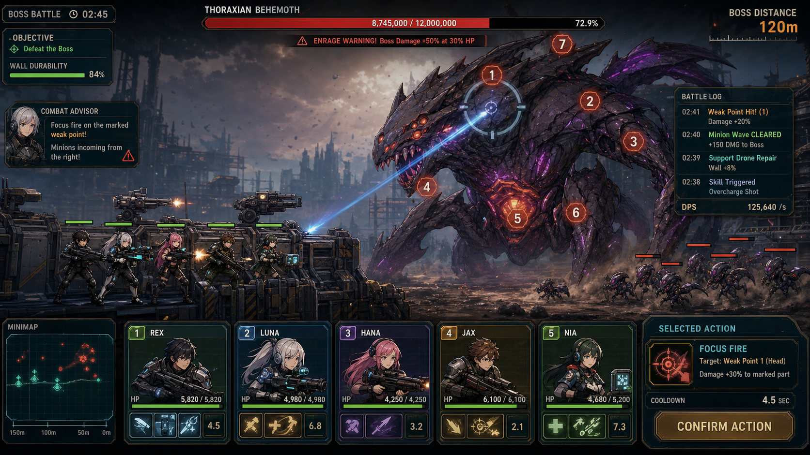
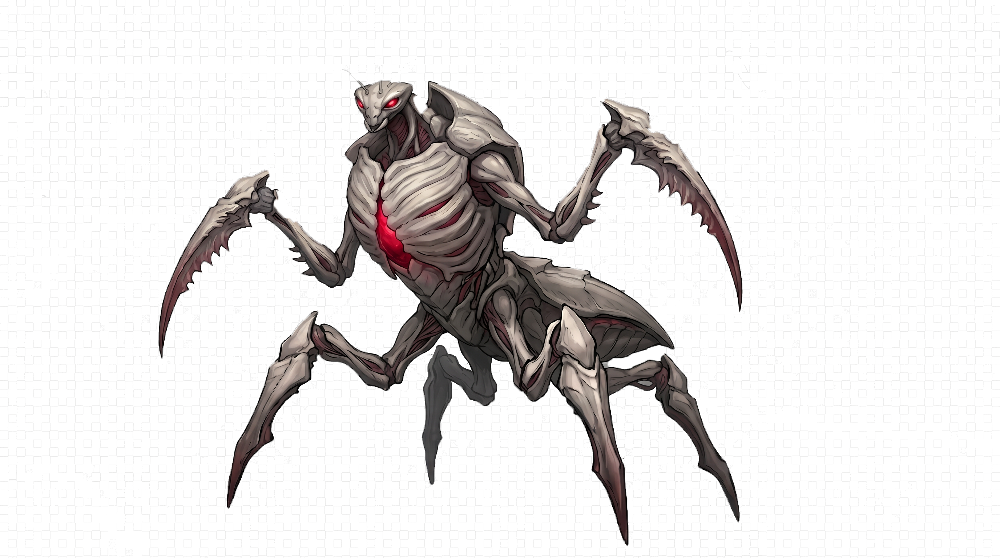

# SquadVsMonster 기획서

---

## 플레이 미리보기

### 플레이 미리보기

---
## 최신 변경 사항
### v1.1 보스 HUD / 광폭화 조건 정리
- P0 광폭화 조건을 기획 의도대로 `보스 HP <= 50%` AND `HEAD 또는 CHEST 파괴`로 정정했다.
- 보스 부위 HUD 스냅샷 이벤트를 추가해 HEAD, ARM, LEG, CHEST, CORE의 HP 비율, 비활성, 파괴 상태를 UI가 받을 수 있게 했다.
- 상단 보스 HP UI가 부위별 HP 슬라이더와 `OFF` / `BREAK` 상태 텍스트를 갱신하도록 확장했다.
- EditMode 테스트에 광폭화 조건과 보스 부위 HUD 스냅샷 검증을 추가했다.

### 미니언 타겟팅
- 일반 미니언은 더 이상 모든 상황에서 가장 가까운 바리케이드 하나로만 몰리지 않는다.
- 미니언이 생성된 스폰 레인에 따라 Barricade0, Barricade1, Barricade2를 우선 목표로 삼는다.
- 우선 목표 바리케이드가 파괴되면 남아 있는 바리케이드 중 가장 가까운 곳으로 fallback 한다.
- 바리케이드가 모두 파괴되면 기존처럼 벽, 이후 생존한 아군을 목표로 이동한다.

### 스폰 레인 및 바리케이드 배치
- 바리케이드 3개의 좌표를 더 넓게 분산했다.
- 현재 좌표:
  - Barricade0: `(2.9, 1.16)`
  - Barricade1: `(5.0, 2.10)`
  - Barricade2: `(7.1, 3.04)`
- 스폰 레인은 하단, 중단, 상단 3개로 명확히 나누어 각 바리케이드와 대응되도록 했다.

### 조준 표시
- 선택 캐릭터가 빈 공간을 드래그하면 free-aim 목표로 조준점을 유지한다.
- 선택된 캐릭터가 없는 상태에서 빈 공간을 드래그해도 가장 가까운 생존 아군이 선택되어 조준점이 표시된다.
- 사정거리 밖이어도 조준선과 조준점은 계속 보이며, 발사 가능 여부만 무기 사정거리로 제한한다.

### 캐릭터 시선 방향
- 전투 대상이 있는 오른쪽을 향하도록 캐릭터 스프라이트 방향을 정리했다.
- 왼쪽을 향하던 Charlie 스프라이트는 `flipX`로 보정한다.

### 이미지 리소스 복구
- `SquadVsMonster/Repair Image Links` 메뉴를 추가했다.
- 배치 실행 메서드 `ResourceRepairUtility.RepairImageLinksCLI`로 씬과 미니언 프리팹의 Sprite 참조를 경로 기준으로 재연결할 수 있다.
- 복구 대상은 배경, 보스, 바리케이드, 캐릭터, 도로 장애물, 미니언 프리팹, 탄환 프리팹이다.

### 캐릭터 배치와 공격 사정거리
- 캐릭터 슬롯 X 간격을 최소 1.10 월드 유닛으로 넓혀 스프라이트가 겹치지 않게 분산 배치한다.
- 시작 보스 조준점까지 기본 무기 사정거리가 닿도록 기본 사정거리를 16 월드 유닛으로 조정한다.
- Bravo, Charlie, Delta, Echo 무기 사정거리를 현재 전투 시작 거리 기준으로 재조정해 모든 캐릭터가 전투 시작 직후 공격할 수 있게 한다.

### UI/전장 이미지 리소스
- 예시 이미지의 어두운 SF 전술 HUD 방향에 맞춘 1차 이미지 리소스 목록을 `docs/image_resource_list_2026-05-28.md`에 정리한다.
- 생성 리소스는 HUD/UI 아틀라스, 스킬/상태 아이콘 아틀라스, 전장 오브젝트 투명 아틀라스다.
- 생성 리소스는 기존 원화 교체가 아니라 레이아웃 및 UI 비주얼 개선에 사용할 보강 에셋으로 관리한다.
- 생성 리소스에서 UI/오브젝트 슬라이스를 분리하고 `GeneratedVisualApplicator.ApplyGeneratedVisualsCLI`로 Game 씬에 적용한다.
- 우측 전술 상태 스택, 미니맵 프레임, 폭격 아이콘, 보스 파츠 아이콘, 캐릭터별 스쿼드 카드 프레임을 추가한다.
- 버튼/프레임 전용 아틀라스를 추가 생성하고, 폭격 버튼/상태 패널/HP바/결과 화면 버튼에 적용한다.
- 캐릭터 카드에 초상화, 상태 태그, 무기 아이콘을 적용한다.
- 보스 HUD에는 보스 초상 프레임과 광폭화 경고 VFX를 추가한다.
- 하단 중앙에는 AIR, EMP, GRAV, LOCK 4칸 스킬바를 추가한다.
- 전투 화면 중앙에는 약점/치명타/사정거리 밖/쉴드 히트 피드백 배지를 추가한다.

## 검증
- EditMode 테스트에 레인별 바리케이드 우선 선택 테스트를 추가했다.
- EditMode 테스트에 스폰 레인 판정 테스트를 추가했다.
- EditMode 테스트에 free-aim 조준 유지 테스트를 추가했다.
- EditMode 테스트에 캐릭터 슬롯 간격과 기본 공격 사정거리 검증을 추가했다.
- 이미지 GUID와 Sprite 참조를 대조해 missing sprite 참조가 없는지 확인한다.
- 생성 이미지 리소스는 Unity 임포트 후 아틀라스 단위로 보관하고, UI 적용 단계에서 개별 스프라이트로 분리한다.
- 생성 UI 적용 후 `Game.unity`에 `GeneratedMiniMapPanel`, `GeneratedStatusStack`, `GeneratedVisualProps`가 포함되는지 확인한다.
- 버튼/프레임 적용 후 `Result.unity`에 `GeneratedRetryCorner`, `GeneratedMenuCorner`가 포함되는지 확인한다.
- 전체 HUD 적용 후 `Game.unity`에 `GeneratedSkillBar`, `GeneratedCombatFeedback`, `GeneratedBossPortrait`, `GeneratedPortrait`가 포함되는지 확인한다.

<!-- APPLIED_RESOURCES_START -->
## 적용 리소스

> 자동 갱신: 2026-06-04. 코드, 씬, 프리팹, 설정 파일에서 참조가 확인된 리소스 기준입니다.

- 이미지/스프라이트: `Assets/Sprites/Background/stage_1.png`, `Assets/Sprites/Character/character (1).png`, `Assets/Sprites/Character/character (2).png`, `Assets/Sprites/Character/character (3).png`, `Assets/Sprites/Character/character (4).png`, `Assets/Sprites/Character/character (5).png`, `Assets/Sprites/circle.png`, `Assets/Sprites/Enemy/B_1_NM.png`, `Assets/Sprites/Enemy/M_1_Runner.png`, `Assets/Sprites/Enemy/M_2_Leader.png`, `Assets/Sprites/Enemy/M_3_Shooter.png`, `Assets/Sprites/Object/Generated/Slices/barricade_broken_01.png` 외 70개
- Unity/프리팹: `Assets/Configs/BossConfig.asset`, `Assets/Configs/MinionConfig_Berserker.asset`, `Assets/Configs/MinionConfig_Runner.asset`, `Assets/Configs/MinionConfig_Spitter.asset`, `Assets/Configs/SquadConfig_Alpha.asset`, `Assets/Configs/SquadConfig_Bravo.asset`, `Assets/Configs/SquadConfig_Charlie.asset`, `Assets/Configs/SquadConfig_Delta.asset`, `Assets/Configs/SquadConfig_Echo.asset`, `Assets/Prefabs/Berserker.prefab`, `Assets/Prefabs/Bullet.prefab`, `Assets/Prefabs/Runner.prefab` 외 1개

메모:
- 리소스 후보 155개 중 자동 참조 확인 95개.
<!-- APPLIED_RESOURCES_END -->

<!-- RESOURCE_PREVIEWS_START -->
## 공유용 이미지 미리보기

> 자동 갱신: 2026-06-04. 공유 시 문서와 함께 아래 이미지 경로가 포함되어야 합니다.

.png)
- `Assets/Sprites/Character/character (1).png`

.png)
- `Assets/Sprites/Character/character (2).png`

.png)
- `Assets/Sprites/Character/character (3).png`

.png)
- `Assets/Sprites/Character/character (4).png`

.png)
- `Assets/Sprites/Character/character (5).png`

- `Assets/Sprites/Enemy/B_1_NM.png`

<!-- RESOURCE_PREVIEWS_END -->

