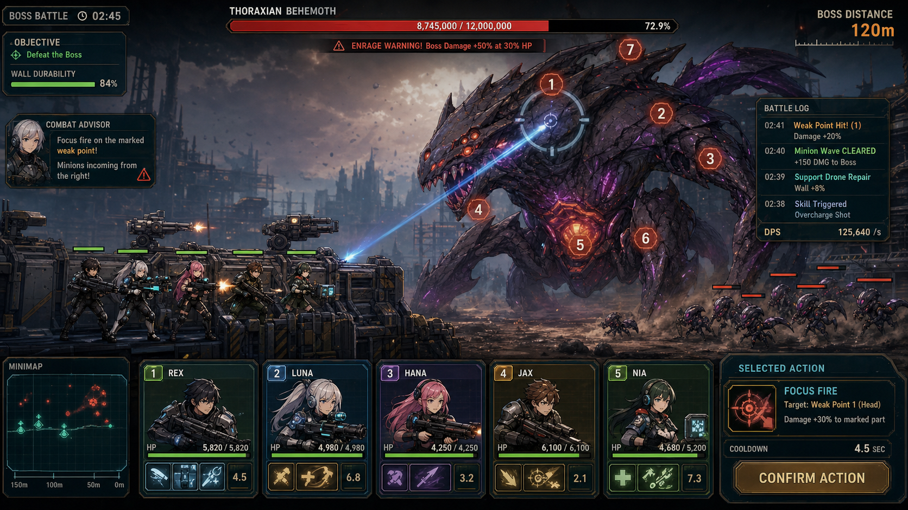

# SquadVsMonster 기획서 v1.6.0

최신화: 2026-07-16 KST

## 문제 정의

스쿼드 자동전투와 보스 공략을 좋아하는 플레이어는 전투가 자동으로 진행될수록 “내 조합이 왜 이겼고 왜 졌는지”를 놓치기 쉽다. SquadVsMonster는 짧은 보스전 세션에서 약점 조준, 재장전 타이밍, 생존 커버, 조합 성향을 읽히게 만들어 다음 배치 조정을 바로 떠올리게 하는 Unity 기반 전투 프로토타입이다.

## 한 줄 소개

보스 약점과 스쿼드 역할을 읽고, 자동전투 결과를 다음 편성 판단으로 연결하는 세션형 보스 공략 게임.

## 주 페르소나

| 구분 | 내용 |
|---|---|
| 이름 | 서유나 |
| 나이 / 직업 | 27세 / 모바일 RPG와 자동전투 게임을 병행하는 직장인 |
| 현재 행동 | 전투 결과 화면을 보고 조합, 역할, 약점 타격 성공 여부를 비교한다. |
| 사용 맥락 | 출퇴근 또는 짧은 휴식 시간에 1~3판을 반복하고, 실패 원인을 빠르게 파악해 다음 조합을 바꾼다. |
| 이탈 지점 | 패배 원인이 “전투력이 낮음”처럼 뭉뚱그려지거나, HUD가 전투 중 무엇을 해야 하는지 알려주지 않으면 반복 의욕이 떨어진다. |

## 핵심 루프

유저가 스쿼드를 편성한다 → 조합 프리뷰로 화력/방어/포지션 성향을 확인한다 → 전투 중 약점과 재장전 상태를 보며 조준을 조정한다 → 결과 화면에서 승패 병목과 다음 조정 포인트를 읽는다 → 다시 스쿼드와 역할을 조정한다.

## 30초 플레이 흐름

| 시점 | 플레이어가 보는 것 | 기대 판단 |
|---|---|---|
| 0~5초 | CombatAdvisorHUD의 조합 프리뷰 | 이번 조합이 화력형인지, 생존이 얇은지, 사거리 구성이 섞였는지 확인한다. |
| 5~20초 | 보스 부위 상태, 방벽 압박, 재장전/다운 조언 | CORE/CHEST/LEG/ARM 우선순위를 바꾸고, 준비된 슈터를 약점에 붙인다. |
| 20~30초 | 승패 결과와 cue line | 패배가 생존/화력/재장전/타이밍 중 어디에서 발생했는지 이해한다. |

## MVP 가설

| 가설 | 검증 방법 | 현재 상태 |
|---|---|---|
| 전투 전 조합 성향을 한 줄로 보여주면 유저가 첫 웨이브 이전에 역할 분담을 이해한다. | `GetSquadCompositionPreview` 테스트와 HUD 표시 확인 | 구현됨, 씬 시각 검증 필요 |
| 결과 화면에 cue line이 있으면 패배 후 다음 행동이 더 명확해진다. | 승리/생존 실패/화력 실패/타이밍 실패 케이스 테스트 | v1.6.0 구현됨 |
| 자동전투라도 보스 약점과 재장전 신호가 보이면 수동 개입감이 생긴다. | CombatAdvisorHUD 플레이 스모크 | 부분 검증 필요 |

## 레퍼런스 분석

| 레퍼런스 | 핵심 행동 단계 | 적용 교훈 |
|---|---:|---|
| 승리의 여신: 니케 보스전 | 조합 확인 → 약점 조준 → 버스트 타이밍 → 결과 보상 | 보스 부위와 역할 판단이 시각적으로 분리되어야 한다. |
| 모바일 자동전투 RPG | 편성 → 자동전투 → 결과 → 성장/재편성 | 결과 화면은 보상보다 “다음에 뭘 바꿀지”를 먼저 말해야 반복이 산다. |
| 로그라이트 보스 러시 | 짧은 실패 → 원인 파악 → 즉시 재도전 | 실패 원인은 한 줄 cue로 빨리 읽히는 것이 중요하다. |

## 게임 구성과 규칙

| 영역 | 규칙 |
|---|---|
| 플랫폼 / 엔진 | Unity 프로젝트가 권위 소스다. 웹/Vite 경로는 임시 프로토타입이 아니면 사용하지 않는다. |
| 전투 목표 | 보스가 방벽을 무너뜨리기 전에 약점 부위를 파괴하고 체력을 소진한다. |
| 조합 프리뷰 | 스쿼드 무기 DPS, HP, 사거리, 특수 역할, 약점 우선순위로 Firepower/Defense/Position 라벨을 만든다. |
| 전투 중 HUD | 보스 부위 상태, 방벽 위험, 재장전 수, 다운 수를 바탕으로 현재 조언을 표시한다. |
| 결과 요약 | `WaveResultSummary`가 title, reason, nextAdjustment, cueLine을 제공한다. |
| 패배 유형 | 생존 붕괴, 화력 부족, 재장전 겹침, 마무리 타이밍 실패로 나뉜다. |

## v1.6.0 개선 내용

| 개선 | 적용 파일 | 효과 |
|---|---|---|
| Result cue line | `Assets/Scripts/UI/CombatAdvisorLogic.cs`, `ResultUI.cs`, `CombatAdvisorUI.cs` | 승패 결과에서 병목을 한 줄로 다시 강조한다. |
| Squad composition preview | `CombatAdvisorLogic.cs`, `CombatAdvisorUI.cs` | 전투 시작 전 화력/방어/포지션 판단을 HUD에 보여준다. |
| 테스트 케이스 확장 | `Assets/Tests/EditMode/CombatAdvisorLogicTests.cs` | cue line 3종과 조합 프리뷰 3종을 회귀 테스트한다. |
| 문서 복구 | `docs/SquadVsMonster_기획서.*`, `docs/SquadVsMonster_업데이트_내역서.*` | 현재 구현 상태와 다음 검증 지점을 readable UTF-8로 맞춘다. |

## 구현 상태 매트릭스

| 영역 | 상태 | 메모 |
|---|---|---|
| CombatAdvisorHUD | 구현됨 | 보스 약점, 방벽 위협, 재장전/다운 상태 조언을 표시한다. |
| Wave Result Summary | 구현됨 | 결과 원인과 다음 조정, cue line을 같은 모델에서 만든다. |
| ResultUI 연결 | 구현됨 | reason 아래 cue line을 함께 표시한다. |
| Squad Composition Preview | 구현됨 | 편성 배열을 기반으로 조합 성향을 계산한다. |
| ResultUI 시각 검증 | 필요 | 실제 Unity 씬에서 폰트 크기, 버튼 겹침, 해상도 대응 확인이 필요하다. |
| 실행파일 최신성 | 검증 후 확정 | Unity BatchMode 빌드 성공 시 v1.6.0 portable로 갱신한다. |

## UI/HUD/컨트롤 원칙

- HUD는 전투 전에는 조합 프리뷰, 전투 중에는 보스/스쿼드 상태 조언을 우선한다.
- 결과 화면은 제목, 원인, cue line, 다음 조정 순서로 읽히게 한다.
- 같은 레이어의 결과 텍스트와 버튼은 겹치지 않아야 한다.
- 긴 cue line이 들어와도 한 줄 또는 두 줄 내에서 읽히도록 폰트 크기와 앵커를 확인한다.

## VFX/오디오/피드백 커버리지

현재 v1.6.0의 핵심 피드백은 텍스트 HUD와 결과 cue다. 다음 시각 개선은 패배 병목별 색상/아이콘을 붙이는 방향이 적합하다. 예를 들어 생존 병목은 방벽 경고, 화력 병목은 약점 마커, 재장전 병목은 탄창/쿨다운 아이콘으로 분리할 수 있다.

## 적용 리소스

| 리소스 | 용도 |
|---|---|
| `docs/SquadVsMonster_gameplay_preview.png` | 문서용 플레이 예시 이미지 |
| `docs/SquadVsMonster_01_플레이예시.png` | 공유용 예시 이미지 |
| `docs/app_icon.png` | 문서/아이콘 참고 이미지 |
| `Assets/Sprites/Object/Barricade_1.png` | 전투 방벽 스프라이트 |

## 공유용 이미지 미리보기

## 빌드, 테스트, 릴리즈 명령

| 목적 | 명령 |
|---|---|
| EditMode 테스트 | `Unity.exe -batchmode -quit -projectPath C:\Development\12_NIKKE -executeMethod CommandLineEditModeTestRunner.Run` |
| Windows 빌드 | `Unity.exe -batchmode -quit -projectPath C:\Development\12_NIKKE -executeMethod BuildScript.BuildWindowsCLI` |
| 산출물 | `Build/SquadVsMonster.exe`를 기준으로 root/release portable과 Drive 배포본을 갱신한다. |

## 성공 KPI

| KPI | 목표 |
|---|---:|
| 결과 화면에서 다음 조정 포인트를 5초 안에 설명할 수 있는 테스트 플레이어 비율 | 70% 이상 |
| 전투 전 조합 프리뷰를 보고 첫 조준 역할을 말할 수 있는 테스트 플레이어 비율 | 70% 이상 |
| 패배 후 즉시 재도전 또는 조합 변경을 선택하는 비율 | 60% 이상 |
| ResultUI 텍스트/버튼 겹침 발생 건수 | 0건 |

## 알려진 리스크와 다음 우선순위

| 우선순위 | 항목 | 이유 |
|---|---|---|
| 1 | Unity 씬 시각 스모크 | 로직 테스트만으로는 실제 ResultUI 가독성을 보장할 수 없다. |
| 2 | 병목별 결과 아이콘 | 텍스트만으로는 모바일 화면에서 인지 속도가 느릴 수 있다. |
| 3 | 조합 프리뷰와 실제 전투 결과 비교 로그 | 프리뷰가 플레이 결과와 맞는지 데이터로 확인해야 한다. |
| 4 | 튜토리얼 첫 웨이브 | CORE/CHEST/LEG 역할을 설명하는 초반 학습 장치가 필요하다. |

## 오디오 시스템 (2026-09-08 업데이트)

- **BGM**: Kenney Music Loops의 CC0 OGG 루프 1곡
- **SFX**: 자체 제작한 결정론적 CC0 WAV 6종으로 입력·액션·위험·전환·성공·실패 구분
- **설정**: BGM과 SFX 볼륨 및 음소거 상태를 분리 저장
- **재생**: 브라우저는 사용자 제스처 이후 시작하며 Unity는 Resources 기반 AudioSource로 로드
- **권장 믹스**: BGM 0.28, SFX 0.70
- **라이선스**: 각 오디오 자산 폴더에 CC0 고지 보관
